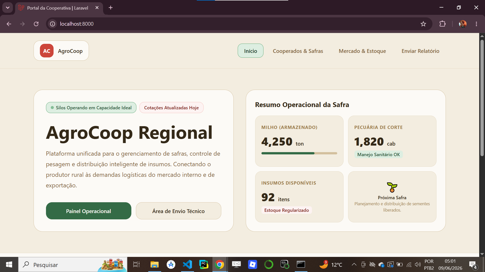
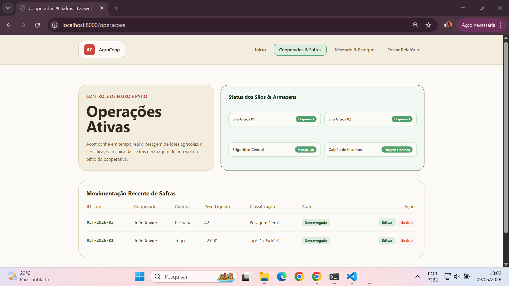
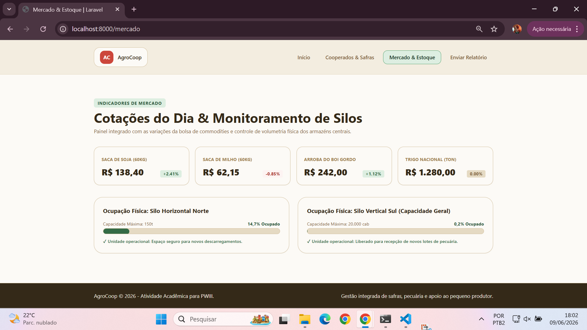
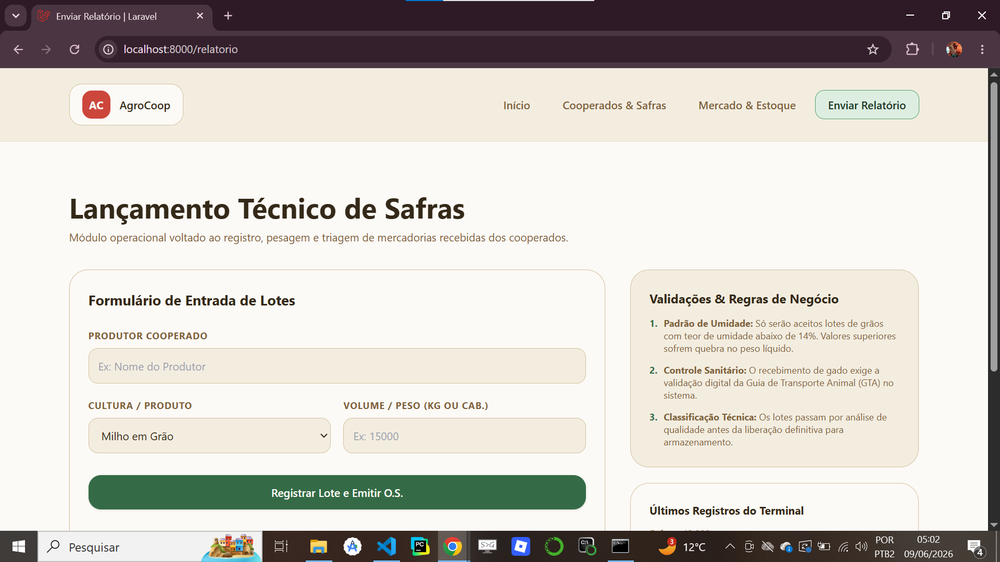

# Agro Coop - Sistema de Gestão para Cooperativa Agropecuária

[](https://github.com/joaoxaviersilva/agro-coop/actions/workflows/lint.yml)

> 🟩 **Badge Verde (Passing):** Garante que o código está estável, seguro e compilando perfeitamente sem erros.

## Sobre o Projeto

O **Agro Coop** é uma aplicação web desenvolvida utilizando o framework Laravel seguindo a arquitetura MVC (Model-View-Controller).

O sistema foi criado como atividade prática da disciplina **Programação Web III (PWIII)** com o objetivo de simular o gerenciamento operacional de uma cooperativa agropecuária, permitindo o registro, controle e acompanhamento de safras recebidas dos cooperados.

A aplicação possui módulos para:

* Controle Operacional
* Registro de Safras
* Gestão de Lotes
* Controle de Estoque
* Monitoramento de Silos
* Visualização de Indicadores Agrícolas

---

# Tecnologias Utilizadas

* PHP 8+
* Laravel 12
* Blade Template Engine
* Eloquent ORM
* MySQL
* Tailwind CSS
* HTML5
* CSS3
* JavaScript

---

# Arquitetura do Projeto

O sistema foi desenvolvido seguindo o padrão MVC.

## Model

Responsável pela comunicação com o banco de dados.

Arquivo:

```php
app/Models/Safra.php
```

Tabela utilizada:

```sql
safras
```

Campos:

| Campo            | Tipo      |
| ---------------- | --------- |
| id               | bigint    |
| lote_codigo      | varchar   |
| cooperado_nome   | varchar   |
| safra_tipo       | varchar   |
| safra_quantidade | double    |
| classificacao    | varchar   |
| status           | varchar   |
| created_at       | timestamp |
| updated_at       | timestamp |

---

## Controller

Arquivo:

```php
app/Http/Controllers/CooperativaController.php
```

Responsável pela lógica de negócio do sistema.

### Método home()

Renderiza a página inicial.

```php
public function home()
{
    return view('home');
}
```

---

### Método operation()

Consulta todos os lotes cadastrados no banco de dados e envia para a view operacional.

```php
public function operation()
{
    $lotes = Safra::latest()->get();

    return view('operation', compact('lotes'));
}
```

---

### Método stock()

Renderiza a tela de mercado e estoque.

```php
public function stock()
{
    return view('stock');
}
```

---

### Método report()

Renderiza o formulário de cadastro e exibe os últimos registros cadastrados.

```php
public function report()
{
    $historico = Safra::latest()->take(3)->get();

    return view('report', compact('historico'));
}
```

---

### Método storeReport()

Responsável pelo processamento do formulário.

Funções executadas:

* Validação dos dados.
* Geração automática do código do lote.
* Aplicação das regras de negócio.
* Persistência dos dados no banco.
* Redirecionamento para a tela operacional.

```php
public function storeReport(Request $request)
```

---

# Estrutura do Banco de Dados

Migration:

```php
database/migrations/create_safras_table.php
```

Estrutura:

```php
Schema::create('safras', function (Blueprint $table) {
    $table->id();
    $table->string('lote_codigo')->unique();
    $table->string('cooperado_nome');
    $table->string('safra_tipo');
    $table->double('safra_quantidade', 15, 2);
    $table->string('classificacao')->default('Em Análise');
    $table->string('status')->default('Pendente');
    $table->timestamps();
});
```

---

# Rotas da Aplicação

Arquivo:

```php
routes/web.php
```

## Página Inicial

```php
GET /
```

Controller:

```php
home()
```

Nome:

```php
coop.home
```

---

## Operações

```php
GET /operacoes
```

Controller:

```php
operation()
```

Nome:

```php
coop.operation
```

---

## Mercado e Estoque

```php
GET /mercado
```

Controller:

```php
stock()
```

Nome:

```php
coop.stock
```

---

## Relatório

```php
GET /relatorio
```

Controller:

```php
report()
```

Nome:

```php
coop.report
```

---

## Cadastro de Safras

```php
POST /relatorio
```

Controller:

```php
storeReport()
```

Nome:

```php
coop.storeReport
```

---

## Tratamento de Erros

```php
Route::fallback(...)
```

Responsável pela exibição da página personalizada de erro 404.

---

# Demonstração do Sistema

## Página Inicial



---

## Controle Operacional



---

## Mercado e Estoque



---

## Cadastro de Safras



---

# Instalação

Clone o repositório:

```bash
git clone https://github.com/joaoxaviersilva/agro-coop.git
```

Acesse a pasta:

```bash
cd agro-coop
```

Instale as dependências:

```bash
composer install
```

Copie o arquivo de ambiente:

```bash
cp .env.example .env
```

Gere a chave da aplicação:

```bash
php artisan key:generate
```

Configure o banco de dados no arquivo:

```env
.env
```

Execute as migrations:

```bash
php artisan migrate
```

Inicie o servidor:

```bash
php artisan serve
```

Acesse:

```text
http://127.0.0.1:8000
```

---

# Estrutura Simplificada

```text
app
├── Http
│   └── Controllers
│       └── CooperativaController.php
│
├── Models
│   └── Safra.php

database
└── migrations
    └── create_safras_table.php

resources
└── views
    ├── home.blade.php
    ├── operation.blade.php
    ├── report.blade.php
    ├── stock.blade.php
    └── errors
        └── 404.blade.php
    └── layouts
        └── app.blade.php

routes
└── web.php
```

---

# Funcionalidades

* Cadastro de cooperados.
* Registro de safras.
* Geração automática de lotes.
* Classificação automática de produtos.
* Controle operacional.
* Histórico de movimentações.
* Monitoramento de estoque.
* Indicadores agrícolas.
* Tratamento de erro 404 personalizado.
* Persistência de dados em banco relacional.

---

# Autor

**João Victor Xavier da Silva**

Projeto desenvolvido para a disciplina de Programação Web III (PWIII).

Centro Paula Souza - ETEC.
